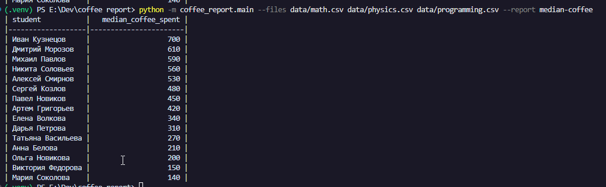

# Coffee Report

CLI-утилита для построения отчётов по CSV-файлам с данными о подготовке студентов к экзаменам.

Поддерживаемый отчёт:
- `median-coffee` — медианная сумма трат на кофе по каждому студенту по всем переданным файлам.

## Пример запуска

Необходимо создать папку data и загрузить туда необходимые данные. 

Также, необходимо создать виртуальное окружение, активировать его и загрузить необходимые пакеты.
```bash
python -m venv .venv

# Linux
source venv/bin/activate
# Windows
source venv/scripts/activate

pip install -r requirements-dev.txt
```
Пример запуска:

```bash
python -m coffee_report.main --files data/data1.csv data/data2.csv --report median-coffee
```

## Пример вывода

